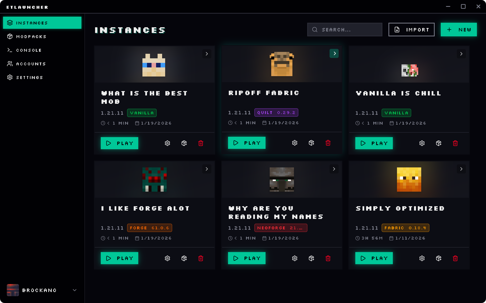
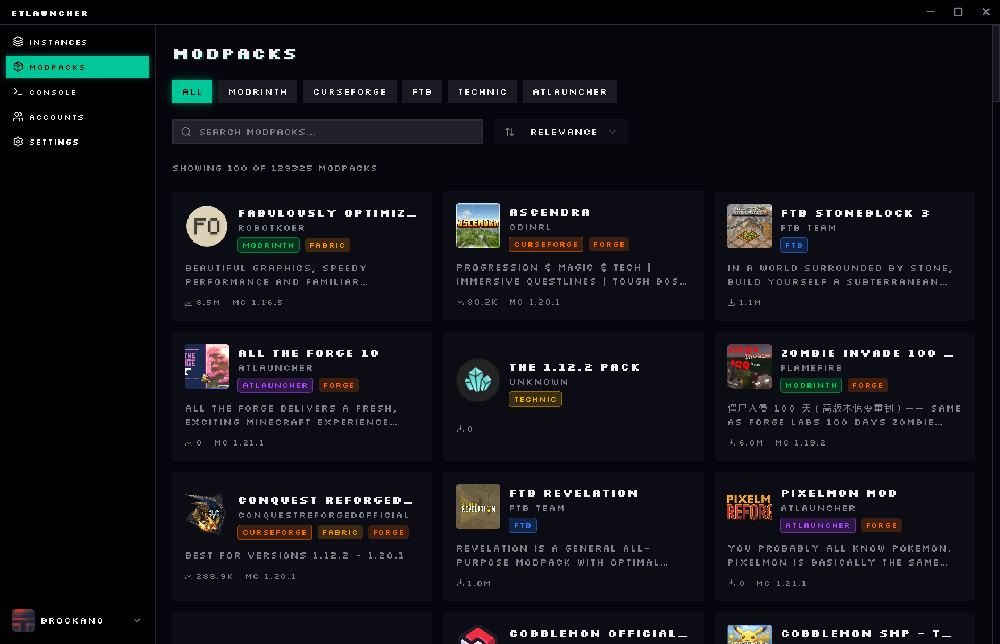
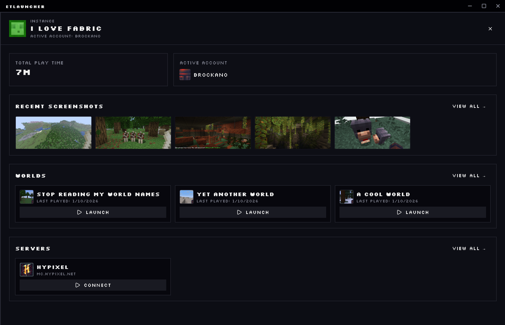
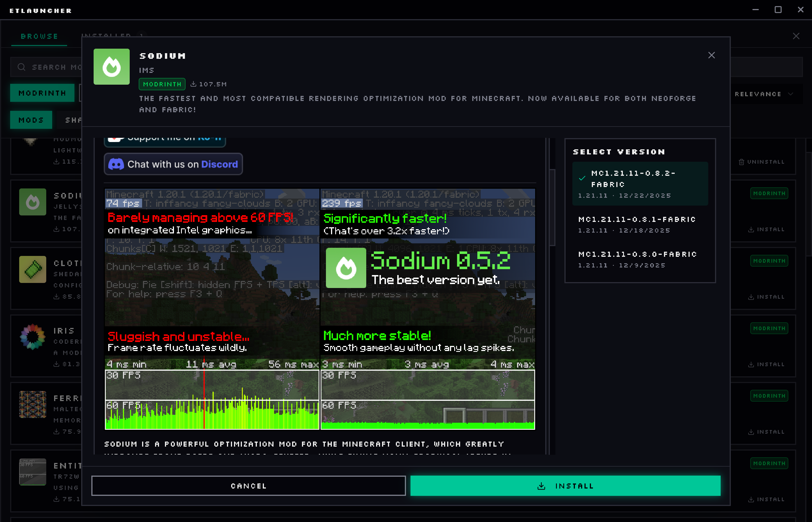
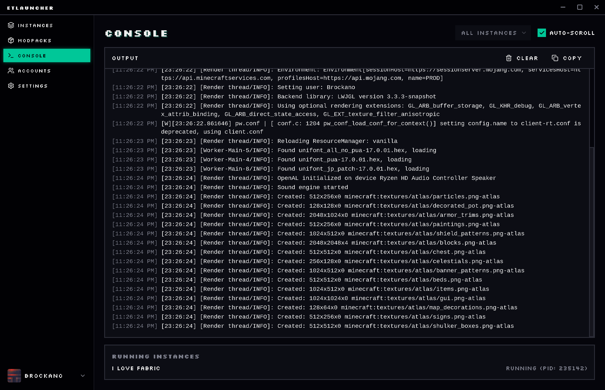

<p align="center">
  
</p>
<h1 style="font-size: 38px;" align="center">ETlauncher</h1>
<p align="center"><em>An Alien's Minecraft Launcher</em></p>

<div align="center" style="line-height: 1;">
  
 <a href="https://rust-lang.org"> 
  <a href="https://bun.com">
  <a href="https://svelte.com/"> 
  <br>
  <a href="https://v2.tauri.app"> 
  <a href="https://typescriptlang.org"> 
    <br>
  <a href="https://github.com/firemonster612/ETlauncher/blob/master/LICENSE"></a>
  <br>
</div>

A fast, modern Minecraft launcher that brings together modpacks from CurseForge, Modrinth, ATLauncher, FTB, and Technic in one place. Built with Tauri and Rust for native performance across Windows, macOS, and Linux.

## Features

- 5 modpack platforms in one place
- One-click mod installation with dependency resolution
- Smart Java management
- Multiple Microsoft accounts
- Powerful instance management
- Update checking for packs and mods
- Native cross-platform (Tauri + Rust)

## Screenshots

<p align="center">
  
  
  
</p>
<p align="center">
  
  
</p>

## Installation

Download the latest release from the [Releases](https://github.com/firemonster612/ETlauncher/releases) page.

### Windows

Download and run `ETlauncher_x.x.x_x64-setup.exe`.

> **Note:** The app is unsigned. Windows SmartScreen may show a warning - click "More info" then "Run anyway".

### macOS

Download `ETlauncher_x.x.x_aarch64.dmg` (Apple Silicon) or `ETlauncher_x.x.x_x64.dmg` (Intel).

> **Note:** The app is unsigned. Right-click the app and select "Open" to bypass Gatekeeper on first launch.

### Linux

Download the `.AppImage` file, make it executable, and run:

```bash
chmod +x ETlauncher_x.x.x_amd64.AppImage
./ETlauncher_x.x.x_amd64.AppImage
```

Alternatively, `.deb` and `.rpm` packages are available.

## Building from Source

Requires [Rust](https://rustup.rs/) and [Bun](https://bun.sh/).

```bash
git clone https://github.com/firemonster612/ETlauncher.git
cd ETlauncher
bun install
bun run tauri build
```

See [CONTRIBUTING.md](CONTRIBUTING.md) for detailed setup instructions and platform-specific dependencies.

## Contributing

Contributions are welcome! Please read [CONTRIBUTING.md](CONTRIBUTING.md) for guidelines on setting up the development environment and submitting pull requests.

## License

This project is licensed under the [MIT License](LICENSE).https://img.shields.io/github/license/firemonster612/ETlauncher?style=for-the-badge
